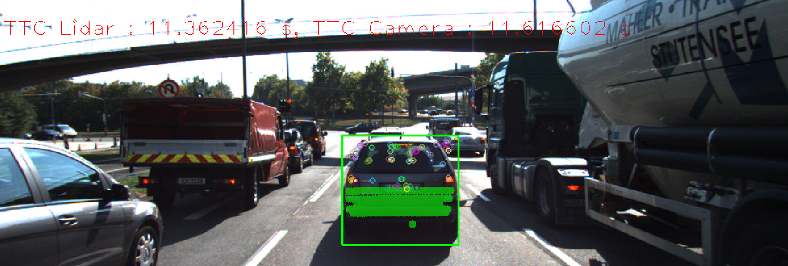
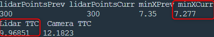
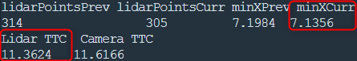
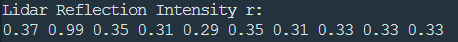
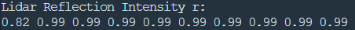
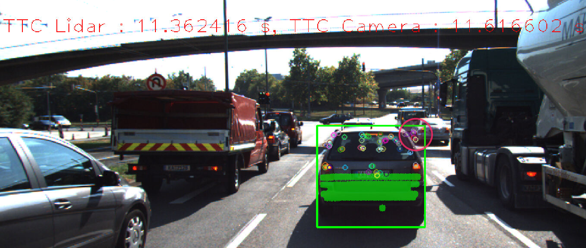
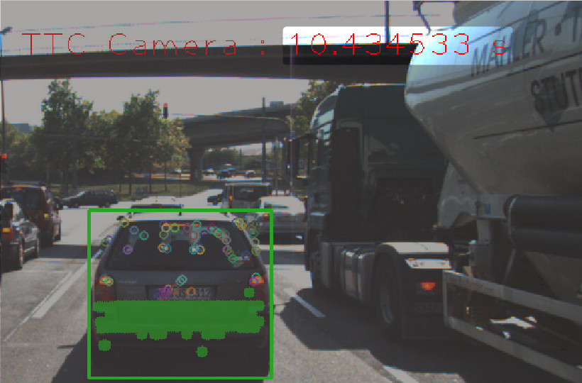
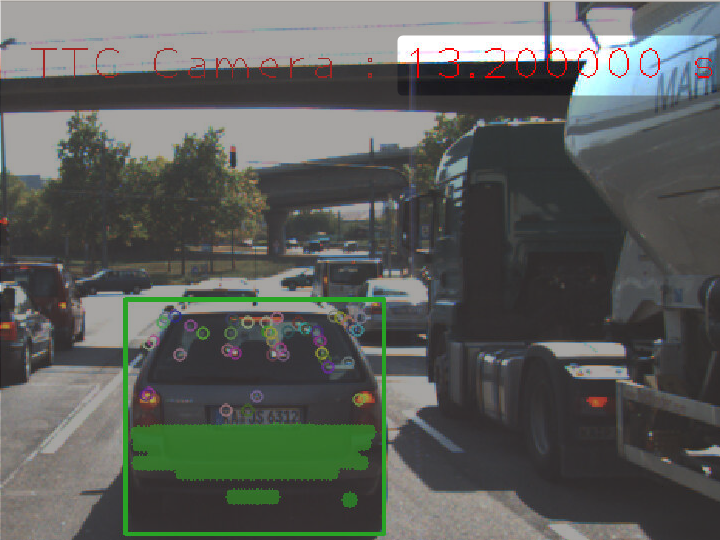
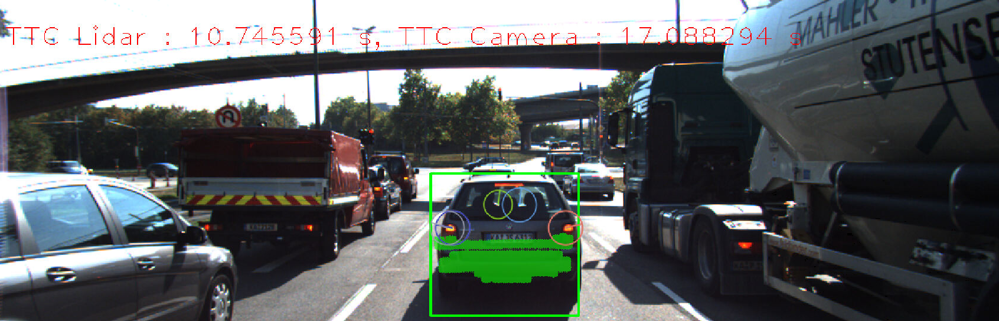

# SFND 3D Object Tracking

This is the final project of the camera course. By completing all the lessons, you now have a solid understanding of keypoint detectors, descriptors, and methods to match them between successive images. Also, you know how to detect objects in an image using the YOLO deep-learning framework. And finally, you know how to associate regions in a camera image with Lidar points in 3D space. Below is our program schematic to be accomplished.

In this final project,  four major tasks are completed: 
1. First, you will develop a way to match 3D objects over time by using keypoint correspondences. 
2. Second, you will compute the TTC based on Lidar measurements. 
3. You will then proceed to do the same using the camera, which requires to first associate keypoint matches to regions of interest and then to compute the TTC based on those matches. 
4. And lastly, you will conduct various tests with the framework. Your goal is to identify the most suitable detector/descriptor combination for TTC estimation and also to search for problems that can lead to faulty measurements by the camera or Lidar sensor. In the last course of this Nanodegree, you will learn about the Kalman filter, which is a great way to combine the two independent TTC measurements into an improved version which is much more reliable than a single sensor alone can be. But before we think about such things, let us focus on your final project in the camera course. 

Project Final Video Image:

## Analysis for FP.5 & FP.6

Following are my analysis for the project part5 to part6:

### FP.5 : Performance Evaluation 1

Calculating the TTC(time to collision) with Lidar alone is not sufficient. There can be some common issues shown below:

1.  Some lidar point outliers and indirect speed measurement will have big effect on the TTC accuracy. The below image shows the lidar TTC jump from 9.96s to 11.36s even though the distance from the preceding vehicle did not change too much.
   

   

2. The lidar is very sensitive to reflection. Different material have different reflection intensity with laser. So, the lidar will get some noise because of this issue.
   The two image were generated during lidar processing. We can see sometimes light intensity was 0.99. This might have saturated the lidar laser receiver.  

### FP.6 : Performance Evaluation 2

1. Some image keypoints outliers will bring noise to our calculation. The outlier keypoints are inside the red circle from the corner of the green bounding box.

   

2. The TTC was calculated base on the mean keypoints distance. This can only give us a rough estimation. So the accuracy is not very good. We can see the TTC jump by 2s between too frame.

   
   

   
   

The following matrix shows the average time, in ms, for the detector-descriptor combination to finish processing a single frame.

| Descriptor\Detector | Harris | SHITOMASI | FAST     | BRISK  | ORB       | AKAZE  | SIFT   |
| ------------------- | ------ | --------- | -------- | ------ | --------- | ------ | ------ |
| **BRISK**           | 420    | 431.85    | 412.08   | 876.76 | 409.13    | 519.54 | 541.67 |
| **BRIEF**           | 23.60  | 24.98     | **8.36** | 443.82 | **10.82** | 122.99 | 122.81 |
| **ORB**             | 23.63  | 22.30     | **5.11** | 456.00 | 15.17     | 121.23 | x      |
| **FREAK**           | 64.11  | 71.67     | 60.44    | 502.11 | 508.59    | 172.88 | 216.51 |
| **AKAZE**           | x      | x         | x        | x      | x         | 222.82 | x      |
| **SIFT**            | 218.98 | 64.21     | 164.30   | 928.58 | 262.83    | 230.06 | 279.41 |

The top 3 combinations are FAST-BRIEF, FAST-ORB, ORB-BRIEF.  

The following shows the TTC for each frame with FAST-BRIEF, FAST-ORB, and ORB-BRIEF.

| frame\Algorithm Comb | FAST-BRIEF | FAST-ORB | ORB-BRIEF |
| -------------------- | ---------- | -------- | --------- |
| **frame 0**          | 11.24      | 11.45    | 11.76     |
| **frame 1**          | nan        | 52.53    | 28.55     |
| **frame 2**          | 12.93      | 12.39    | nan       |
| **frame 3**          | 11.21      | 11.45    | nan       |
| **frame 4**          | 11.98      | 11.82    | nan       |
| **frame 5**          | 39.14      | 28.71    | 17.09     |
| **frame 6**          | 12.37      | 12.18    | 25.10     |
| **frame 7**          | 13.55      | 11.62    | nan       |
| **frame 8**          | 12.40      | 11.55    | nan       |
| **frame 9**          | 11.93      | 11.71    | 10.46     |
| **frame 10**         | 7.26       | 10.43    | nan       |
| **frame 11**         | 13.20      | 13.20    | nan       |

It turns out the best combination is also the fastest. The reason why ORB-BRIEF does not work well is because it do not have the sufficient amount of keypoints to get the reasonable result.

## Dependencies for Running Locally

* cmake >= 2.8
  * All OSes: [click here for installation instructions](https://cmake.org/install/)
* make >= 4.1 (Linux, Mac), 3.81 (Windows)
  * Linux: make is installed by default on most Linux distros
  * Mac: [install Xcode command line tools to get make](https://developer.apple.com/xcode/features/)
  * Windows: [Click here for installation instructions](http://gnuwin32.sourceforge.net/packages/make.htm)
* OpenCV >= 4.1
  * This must be compiled from source using the `-D OPENCV_ENABLE_NONFREE=ON` cmake flag for testing the SIFT and SURF detectors.
  * The OpenCV 4.1.0 source code can be found [here](https://github.com/opencv/opencv/tree/4.1.0)
* gcc/g++ >= 5.4
  * Linux: gcc / g++ is installed by default on most Linux distros
  * Mac: same deal as make - [install Xcode command line tools](https://developer.apple.com/xcode/features/)
  * Windows: recommend using [MinGW](http://www.mingw.org/)

## Basic Build Instructions

1. Clone this repo.
2. Make a build directory in the top level project directory: `mkdir build && cd build`
3. Compile: `cmake .. && make`
4. Run it: `./3D_object_tracking`.